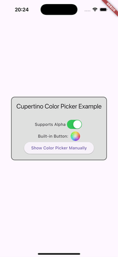

# Cupertino Color Picker

A Flutter plugin that provides access to the native iOS `UIColorPickerViewController` and `UIColorWell` in Flutter apps.



## Introduction

This plugin brings the native iOS color selection components directly to your Flutter applications. It provides a seamless, platform-native color selection experience for iOS users while maintaining the simplicity and flexibility that Flutter developers expect.

**Note**: This plugin only works on iOS 14.0+. Using it on Android or other platforms will result in a PlatformException.

## Why Use Cupertino Color Picker?

- **Native Feel**: Gives your iOS users the familiar platform experience they expect
- **Performance**: Leverages native iOS components rather than rebuilding them in Flutter
- **Accuracy**: Proper color space handling ensures colors appear as expected
- **Developer Experience**: No need to build complex color selection UIs from scratch

## Key Features

- 🔵 **True Native Experience**: Uses the actual iOS UI components for authentic iOS look and feel
- 🔄 **Real-time Color Updates**: Receive continuous updates as users interact with the color picker
- 🎨 **Display P3 Color Space Support**: Properly handles wide gamut colors with automatic conversion to sRGB
- 🌓 **Alpha Channel Support**: Optional transparency selection
- 💻 **Simple API**: Follows Flutter's design patterns with an easy-to-use interface
- ✅ **Null Safety**: Fully compatible with Dart's null safety
- 🧩 **Multiple Components**: Supports both `UIColorPickerViewController` (dialog) and `UIColorWell` (button)

## Requirements

- iOS 14.0+ (`UIColorPickerViewController` was introduced in iOS 14)
- Flutter 3.10.0+
- Dart SDK 3.0.0+

## Usage

### Installation

Add this to your package's pubspec.yaml file:

```yaml
dependencies:
  cupertino_color_picker: ^0.2.0
```

### Basic Usage

```dart
import 'package:cupertino_color_picker/cupertino_color_picker.dart';
import 'package:flutter/material.dart';

Future<void> showColorPickerExample() async {
  try {
    // Show the color picker (similar to other Flutter show* functions)
    final color = await showCupertinoColorPicker(
      initialColor: Colors.blue, // Pass a Color object
      supportsAlpha: true, // Whether to support transparency
      onChanged: (color) {
        // This is called continuously as the user changes the color
        setState(() => _liveColor = color);
      },
    );
    
    // Returns null if user cancels
    if (color != null) {
      // Use the final selected color after the picker is closed
      setState(() => _selectedColor = color);
    }
  } catch (e) {
    print('Color picker error: $e');
  }
}
```

### Color Picker Button

The plugin also provides a native `UIColorWell` button component:

```dart
import 'package:cupertino_color_picker/cupertino_color_picker.dart';
import 'package:flutter/material.dart';

// Use the CupertinoColorPickerButton widget
CupertinoColorPickerButton(
  size: 40, // Size of the button
  initialColor: Colors.blue, // Initial color
  supportsAlpha: true, // Support for transparency
  onChanged: (color) {
    // Called when the user changes the color
    setState(() => _selectedColor = color);
  },
)
```

## Color Space Support

This plugin supports the 'Display P3' color space from iOS. It properly handles colors selected as 'Display P3 Hex Color' in `UIColorPickerViewController` so they can be correctly represented in Flutter apps.

The plugin automatically converts colors selected in the Display P3 color space to the sRGB color space to ensure they display correctly in Flutter.

## Contributing

Contributions, feature requests, and bug reports are welcome via GitHub issues and pull requests!

## License

This plugin is licensed under the MIT License - see the LICENSE file for details.